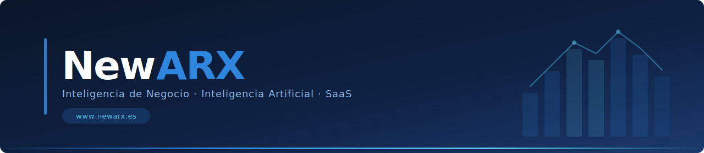

  

 

NewARX es una empresa de soluciones tecnológicas fundada en 2022 con el propósito de **democratizar el uso de los datos** en las organizaciones. Equipo multidisciplinar con más de 20 años de experiencia en tecnología, operaciones, finanzas y área comercial.

Ofrecemos soluciones 360º que conectan todas las áreas de una organización con **acompañamiento personalizado** durante la implantación y el primer año de uso.

---

## Qué hacemos

<table>
<tr>
<td width="33%" valign="top">

### Inteligencia de Negocio
Diseñamos e implantamos arquitecturas de datos y cuadros de mando que convierten datos dispersos en información accionable. Trabajamos con los ERPs más extendidos en el mercado industrial y de distribución.

</td>
<td width="33%" valign="top">

### Inteligencia Artificial
Desarrollamos y aplicamos soluciones de IA orientadas a la automatización de procesos, análisis predictivo y extracción de conocimiento a partir de documentación no estructurada.

</td>
<td width="33%" valign="top">

### Kit Digital / Kit Consulting
Somos agentes digitalizadores acreditados. Acompañamos a pymes en la implantación de soluciones de BI e IA dentro del programa Kit Digital y Kit Consulting del Gobierno de España.

</td>
</tr>
</table>

---

## Productos SaaS

<table>
<tr>
<td width="33%" valign="top">

**coFINANCE**

Control económico-financiero sobre el diario contable. Visión completa de rentabilidad, ajustes extracontables y seguimiento de variaciones. Sin dependencia del departamento de IT.

</td>
<td width="33%" valign="top">

**coPlanning**

Planificación de compras, aprovisionamientos y producción. Automatiza la programación diaria con criterios de eficiencia, reduciendo tiempos y volumen de inventarios.

</td>
<td width="33%" valign="top">

**coFIT+**

7 módulos de BI vertical para el sector de la distribución. Rentabilidad por producto, cliente, comercial, ruta y canal cruzando ventas con costes en tiempo real. Homologado por Grupo Mahou San Miguel.

</td>
</tr>
</table>

---

## Stack tecnológico

**Cloud & Data**

**Visualización & Automatización**

**Lenguajes**

-F2C811?style=flat-square&logo=powerbi&logoColor=black)

**ERPs integrados**

---

## Repositorios

Los repositorios propios de NewARX son privados. Este perfil es visible principalmente porque participamos como **colaboradores en proyectos de clientes**.

El trabajo que desarrollamos habitualmente abarca:

- Conectores y pipelines de integración de datos (Azure Data Factory, REST APIs)
- Visuals personalizados para Power BI con SDK `pbiviz` / TypeScript / D3.js
- Automatizaciones sobre Power Platform y Azure
- Utilidades de procesamiento de datos para el sector de distribución de alimentos y bebidas
- Desarrollos asociados a los productos SaaS propios

---

## Clientes de referencia

Trabajamos con empresas de los sectores de distribución de alimentos y bebidas, producción industrial y alimentación, entre las que se encuentran Aceites Abril, Terras Gauda, Delikia, Dicasa y Gobea, entre otros.

---

  NewARX — Democratizando la inteligencia de negocio · <a href="https://www.newarx.es">newarx.es</a>

